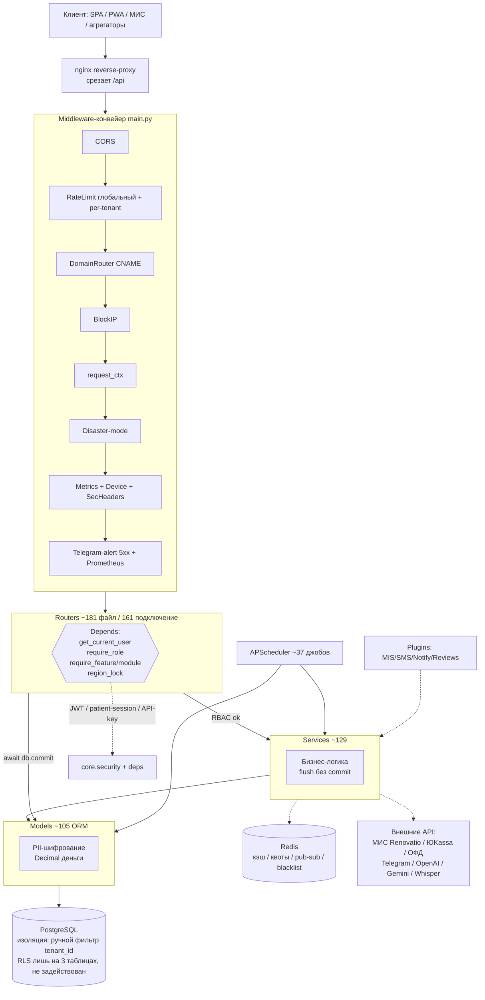

# BACKEND — премиальный обзор «КлиникСеть» (FastAPI)

Мультитенантная МИС/SaaS для сети клиник: FastAPI + SQLAlchemy 2.0 (async/asyncpg) + PostgreSQL + Redis. Бэкенд — это **монолит из ~181 файла роутеров (161 подключение через `include_router`), ~129 сервисов, ~105 ORM-моделей**, собранных в одно приложение `backend/app/main.py`. Семь «кабинетов» (super_admin, franchise_owner, director, manager, accountant, doctor/visiting, patient) живут поверх единого ядра изоляции тенантов и стека middleware.

> Документ построен на reference-доках в [`ref/`](ref/) (полные карточки каждого файла) и на чтении `main.py` / `database.py` / `config.py`. Здесь — карта верхнего уровня: слои, жизненный цикл запроса, доменные группы, фоновые задачи и схемы связей.

---

## 1. Карта слоёв

Архитектура — классический трёхслойный пирог с тонкими роутерами и «толстыми» сервисами:

```
HTTP → Middleware-конвейер → Router (RBAC + валидация) → Service (бизнес-логика) → Model (ORM) → PostgreSQL
                                    │                          │
                                    ├─ Depends: auth/роли/      ├─ Decimal для денег
                                    │   тенант/фича/модуль       ├─ flush(), commit() — у роутера
                                    └─ Pydantic-схемы            └─ tenant_id-фильтр вручную
```

| Слой | Каталог | Роль | Дисциплина |
|---|---|---|---|
| **Routers** | `app/routers/*` (~181 файл, 161 подключение) | FastAPI `APIRouter`, проверка ролей через `Depends`, парсинг тела (Pydantic), сериализация, `await db.commit()` | Тонкие: основную логику делегируют в сервисы. `Decimal → float` на выходе для JSON |
| **Services** | `app/services/*` (~129 файлов) | Бизнес-логика, адаптеры внешних API (МИС, ОФД, эквайринг, Telegram, AI), чистые расчёты | Принимают `AsyncSession` извне; `flush()` без `commit()` — лишь распространённый паттерн, а не правило: значительная часть сервисов (~36 файлов: `referral_service`, `acts_service`, `lab_service`, `fiscal_service`, `acquiring_service`, `onboarding_service`, `push_service`, `security_service`, `bonus_service`, фоновые джобы, `settings_service` и др.) коммитят сами |
| **Models** | `app/models/*` (~105 файлов) | Декларативные ORM-таблицы (`Mapped[...]` + `mapped_column`), наследуют `app.database.Base` | Деньги — `Numeric`/`Decimal`; PII шифруется на уровне модели (property+`__init__`); `tenant_id`-фильтр НЕ на уровне модели |
| **Core** | `app/core/*` (18 файлов) | Сквозные механизмы: auth/RBAC, middleware, лимиты, гейты, криптография | Все гейты — fail-open (super_admin и юзер без tenant проходят) |
| **Schemas** | `app/schemas/*` | Pydantic request/response DTO | Часть на v2 (`ConfigDict`), часть на legacy v1 (`class Config`) |
| **Jobs** | `app/jobs/*` (9 файлов) | Фоновые APScheduler-задачи (напоминания, дайджесты, атрибуция, рассылки) | Своя сессия `AsyncSessionLocal()`, идемпотентность через дедуп |
| **Plugins** | `app/plugins/*` | Лёгкая plugin-система (MIS, SMS, Notify, Reviews) — реестр по имени | MIS/SMS/Notify регистрируются в `_register_plugins()`; `ReviewsPlugin` — отдельно на уровне модуля (`main.py:1852`) |
| **Utils** | `app/utils/*` | Stateless-хелперы: телефоны, IP, метрики, rate-limit, device | Без доменного состояния |

Связанные reference-доки:
- Роутеры: [routers-01](ref/routers-01.md) … [routers-13](ref/routers-13.md)
- Сервисы: [services-01](ref/services-01.md) … [services-09](ref/services-09.md)
- Модели: [models-01](ref/models-01.md) … [models-05](ref/models-05.md)
- Ядро: [core-01](ref/core-01.md)
- Фоновые задачи + схемы: [jobs-schemas-01](ref/jobs-schemas-01.md)
- Плагины + утилиты: [utils-plugins-01](ref/utils-plugins-01.md)

### Как роутеры подключаются в `main.py`

`FastAPI(...)` создаётся **без глобального префикса** (`root_path` не задан, `prefix` при `include_router` не переопределяется). Поэтому фактический путь API = `prefix`, заданный внутри самого `APIRouter(prefix=...)` в файле роутера. Внешний `/api/...` навешивает nginx (reverse-proxy срезает `/api`).

```python
# main.py — мономонтаж роутеров (~161 include_router, без аргумента prefix):
app.include_router(auth.router)            # /auth
app.include_router(referrals.router)       # /referrals
app.include_router(manager_router)         # /manager (агрегатор manager/__init__.py)
app.include_router(accountant_router)      # /accountant (агрегатор accountant/)
app.include_router(admin_router)           # /admin
app.include_router(billing_router)         # /billing
...                                        # и так далее, см. main.py:1636-1852
```

**Особые случаи монтирования:**
- `manager/__init__.py` и `accountant/__init__.py` — родительские `APIRouter(prefix="/manager"|"/accountant")`, к которым приклеиваются суб-роутеры. Итог: `/manager/...`, `/accountant/...`. У `manager/mis_analytics.py` свой `prefix="/analytics"` → двойной `/manager/analytics/*`.
- `acts.py` экспортирует ДВА роутера: `/acts` + алиас `/inter-clinic-acts`.
- `admin_system.py`, `ai_assistant.py`, `telemedicine.py`, `staff_chat.py` — каждый экспортирует пару роутеров (основной + публичный/bot/detailed).
- Несколько роутеров делят один префикс по фазам разработки: `/ads` (4 файла: ads + ads_ai + ads_analytics + ads_workflow), `/clinic/chat` (clinic_chat + chat_promo + chat_sla_stats + slot_holds + chat_counselor), `/engagement` (3 файла), `/franchise-owner/*` (десяток файлов).
- `reg_speed.py` (`/referrals/.../print|search`) подключается ДО `referrals.router` — порядок важен, чтобы статические сегменты (`patients/search`) не перехватились как `/{referral_id}`.

### Middleware-конвейер (`main.py:1484-1634`)

Порядок регистрации определяет порядок выполнения (FastAPI оборачивает в обратном порядке — последний `add_middleware` срабатывает первым на входящем запросе):

| # | Middleware | Назначение | Источник |
|---|---|---|---|
| 1 | `CORSMiddleware` | CORS из `settings.get_allowed_origins()` | starlette |
| 2 | `SlidingWindowRateLimiter(200/60s)` | Глобальный per-IP rate-limit на Redis (in-memory fallback) | [core-01](ref/core-01.md) `security_utils.py` |
| 3 | `RateLimitMiddleware` | Per-tenant RPM из `TenantQuota` (после глобального) | `rate_limit_middleware.py` |
| 4 | `DomainRouterMiddleware` | Резолв тенанта по кастомному `Host` (CNAME) | `domain_router.py` |
| 5 | `BlockIpMiddleware` | Блок IP из `blocked_ips` (кэш 30с, инвалидация через `app.state.block_ip_mw`) | `block_ip_middleware.py` |
| 6 | `request_ctx_middleware` | Кладёт `Request` в ContextVar (для audit-fallback) | `request_ctx.py` |
| 7 | `_disaster_mode_dispatch` | Read-only режим обслуживания по файл-флагу (mutation → 503) | `disaster_middleware.py` |
| 8 | `request_metrics_middleware` | Сбор метрик каждого запроса в Redis | `utils/metrics.py` |
| 9 | `device_detection_middleware` | Парсинг User-Agent + извлечение `client_ip` в `request.state` | `utils/device.py` |
| 10 | `security_headers_middleware` | X-Frame-Options, CSP-заголовки, nosniff | inline |
| 11 | `telegram_alert_middleware` | Catch-all 5xx/exception → Telegram-алерт админу (дедуп 10 мин) | `alert_service.py` |
| 12 | `prometheus_middleware` | Сбор Prometheus-метрик HTTP | `prometheus.py` |

Плюс `/metrics` (Prometheus, защищён токеном), `/health` и `/health/full` (публичные health-чеки для Uptime-Kuma), `/docs`+`/redoc` (только super_admin).

---

## 2. Жизненный цикл запроса

### Аутентификация (`app/core/deps.py`, `app/core/security.py`)

Существуют **три параллельных контура авторизации**:

1. **JWT-сотрудник** — основной. `Bearer`-токен → `get_current_user()` декодирует, грузит активного `User`, обрабатывает impersonation (claim `imp=true` пишет `current_impersonator` в ContextVar). Токены: PBKDF2-SHA256 пароли, HS256 JWT с `jti` (для blacklist), refresh-ротация с reuse-detection (`auth.py`).
2. **Patient-session** — публичный кабинет пациента. Long-lived токен (TTL 365 дней) через `patient_session_service.restore_session`, мульти-источник: `Authorization: Bearer` / `X-Patient-Session` / `?session_token=`/`?t=` / cookie `clinika_patient_session`. Плюс одноразовые `patient_token`/`appointment_token` (по QR/short_code).
3. **Бессекретные/ключевые** — webhook от МИС (`X-Api-Key`), агрегаторы (`X-Agg-API-Key`), публичный API v1 (`clk_live_*` ключ через `api_key_deps.verify_tenant_api_key`), bot-эндпоинты (`X-Bot-Secret`), Telegram-webhook (`X-Telegram-Bot-Api-Secret-Token`).

> **Важная архитектурная деталь:** JWT содержит `sub=user_id`, `role` и `tid=tenant_id` (`auth.py:132-136`, `:381-385`). При этом на рантайме `get_current_user` грузит `User` по `sub` и берёт `tenant_id` из БД — но в самом токене `tenant_id` **есть** (claim `tid`).

### Проверка ролей (RBAC)

Двухуровневая модель:

- **Ролевые гейты-фабрики** (`core/deps.py`): `require_admin`, `require_manager`, `require_reports_access`, `require_franchise_owner`, `require_super_admin`, `require_director`, `require_director_or_owner`, `require_role(*roles)`. Роли — enum `UserRole` (16 значений, см. [models-05](ref/models-05.md)). super_admin определяется по роли **ИЛИ** по `username == settings.superadmin_username`.
- **Гранулярный RBAC «как данные»** (`core/permissions.py`): права вида `referrals:write`. Базовая матрица `ROLE_PERMISSIONS` в коде + per-tenant override в БД (`TenantPermissionOverride`) с Redis-кэшем. `has_permission(user, action, db)` — основная проверка; после изменения override обязателен `invalidate_rbac_cache`.

> **Тонкость фабрик:** `require_permission()` уже возвращает `Depends(...)`, а `require_role`/`require_feature`/`require_module` возвращают «голую» функцию — оборачивать в `Depends(...)` на месте. Дубль `get_current_tenant`: в `deps.py` бросает 403, в `tenant.py` возвращает `None` — разный контракт, импортировать осознанно.

### Мультитенантность (изоляция клиник/тенантов)

Изоляция держится на нескольких уровнях:

| Механизм | Где | Описание |
|---|---|---|
| **Ручной фильтр `tenant_id`** | в каждом роутере/сервисе | Основной способ. `WHERE Model.tenant_id == current_user.tenant_id`. На уровне модели фильтра НЕТ |
| **Postgres RLS** (частичный, фактически НЕ задействован) | `get_tenant_db()` (`core/deps.py`) | RLS включён лишь на 3 таблицах (`referrals`, `bonuses`, `audit_log` — единственная миграция `l2m3n4o5p6q7`). `get_tenant_db` делает `set_config('app.tenant_id', ...)` через bind-параметр, но в роутерах **не используется ни разу** (0 совпадений `Depends(get_tenant_db)`). Обычный `get_db` RLS не ставит — реальная изоляция держится на ручном фильтре `tenant_id` |
| **Per-clinic scope** | `manager/clinics_access.py` | `resolve_clinic_filter_ids()` — единый контракт: `None`=все клиники, `[]`=нет доступа (пустой ответ), `[...]`=WHERE IN. Переиспользуется в analytics/calls/ltv/reports |
| **Франшиза** | `Tenant.franchise_id` | franchise_owner видит все тенанты своей франшизы; cross-tenant чат/звонки через `TenantVisibility` |
| **Фичи тарифа** | `require_feature("...")` | Приоритет: `tenant_modules` override > `license.features` JSONB > дефолты плана. 403 при отсутствии |
| **Платные модули** | `require_module("...")` | Активная/trial/grace подписка в `TenantModuleSubscription`. 402 при отсутствии |
| **Лимиты плана** | `core/limits.check_plan_limit` | Клиники/юзеры по лицензии. 402 при превышении |
| **Подписка-гейт** | `subscription_guard.require_active_subscription` | Write-операции при истёкшей подписке → 402 |
| **Region Lock** | `core/region_lock.enforce_region_lock` | Гео-блок франшизы по региону + IP-allowlist bypass |

> **Сквозной принцип fail-open:** super_admin и пользователь без `tenant_id` проходят все гейты; отсутствие лицензии/подписки трактуется как legacy-тенант и пропускается; внутренние ошибки гейтов не блокируют запрос. При деградации Redis rate-limit/кэши тоже fail-open.

> **Сквозной риск (из ref-доков):** ряд эндпоинтов фильтруют `if session.tenant_id:` (пациентские) или вовсе не фильтруют (`get_badge_counts`, `nps/clinic/stats`, `send_push_to_all`, кампании без сегмента) — потенциальные кросс-тенант утечки, помеченные в reference-доках как кандидаты на фикс.

### Дисциплина денег и шифрования

- **Деньги** — всегда `Decimal` в моделях (`Numeric(12,2)`), на вход `Decimal(str(x))`, наружу `float(...)` для JSON. Эталон корректной работы с Decimal — `partner_offer.py`, `inventory_fifo.py`, `franchise_finance.py`. **НЕ** класть `Decimal` в JSONB-поля (известный класс багов сериализации).
- **PII** шифруется на уровне модели через property + `__init__` (поля `*_encrypted`): `User.address`, `AppointmentOutcome.conclusion/recommendations`, `Referral.notes`, `LabOrder.notes`, `TelemedicineSession.notes`, `PatientDocument.description`. Поиск по plaintext в SQL невозможен. Плюс blind-hash PII (`*_hash`) для exact-match через `pii_sync.py` (SQLAlchemy event-listeners) — телефоны/email/имена. См. `encryption_service.py` ([services-03](ref/services-03.md)).
- **Телефон** — нормализованный (`7XXXXXXXXXX`, `utils/phone.normalize_phone`) — главный ключ идентификации пациента (FK на `patient_accounts` добавляется постепенно, пока nullable). Поиск — через `phone_variants` (форматы `7.../+7.../8...`).

---

## 3. Доменные группы роутеров

| Домен | Ключевые роутеры | Ключевые сервисы | За что отвечает |
|---|---|---|---|
| **Биллинг платформы** | `billing`, `admin` (billing-блок), `commercial`, `marketplace`, `admin_subscription_plans`, `admin_api_quotas`, `acts` | `billing_service`, `acts_service`, `quota_service`, `arr_ltv_service` | Подписки тенантов, счета/платежи, billing_ledger, revenue split, акты оказанных услуг, тарифы, API-квоты, MRR/ARR |
| **Франшиза** | `franchise_owner`, `franchise_owner_clinics`, `franchise_analytics(_ext)`, `franchise_finance`, `franchise_pnl`, `franchise_referral`, `franchise_modules`, `franchise_revenue`, `franchise_module_gaps(_by_clinic)`, `franchise_visibility`, `partner_clinics` | `franchise_billing_service`, `franchise_pnl_service`, `franchise_referral_service`, `kpi_service`, `cohort_service`, `recommendations_service`, `franchise_module_gaps_service` | Кабинет владельца франшизы: P&L сети, перелив пациентов, gap-анализ модулей, биллинг от платформы, рекрутеры, видимость между клиниками, контракты партнёров |
| **Чат** | `clinic_chat`, `patient_chat`, `patient_chat_threads`, `chat_admin`, `chat_ai`, `chat_promo`, `chat_sla_stats`, `chat_counselor`, `staff_chat`, `staff_chat_cross`, `clinic_chat_templates`, `chat_templates`, `slot_holds`, `support` | `chat_service`, `chat_sla_job`, `chat_workflow_service`, `staff_chat_service`, `staff_chat_mentions`, `patient_chat_ai`, `slot_booking_service` | Чат клиника↔пациент (Intercom-стиль, SLA-светофор, реассайн), чат сотрудников (Slack-стиль, WS, реакции, опросы), AI Smart-Reply, шаблоны, slot-букинг в чате, техподдержка |
| **Пациент (ЛК)** | `patient`, `patient_subscription`, `patient_calendar`, `patient_documents(_v2)`, `patient_loyalty`, `patient_lab(_dynamics)`, `patient_medical_record`, `patient_notifications`, `patient_spending`, `patient_family`, `vitals`, `medcard`, `prescriptions`, `portal`, `nps`, `wellness`, `consent`, `public_booking`, `public_clinic` | `patient_session_service`, `family_service`, `calendar_service`, `document_service`, `spending_service`, `vitals_service`, `subscription_service`, `wellness_service`, `loyalty_ext_service` | Кабинет пациента: вход по QR/коду, направления, записи, медкарта, документы, подписка «Здоровье+», семья, лояльность, NPS, 152-ФЗ (экспорт/забвение), публичная онлайн-запись |
| **Врач** | `scheduling`, `appointments`, `doctor_ai`, `doctor_lab`, `doctor_patient_documents`, `external_doctor`, `visiting_doctor` | `scheduling_service`, `doctor_ai_service`, `appointment_costing`, `inventory_fifo` | Расписание, слоты, записи, заключения приёма, AI-briefing и планы лечения, лаб-заявки врача, приезжие/внешние врачи, прямые счета |
| **Админ (super_admin)** | `admin`, `admin_analytics`, `admin_api_quotas`, `admin_arr_ltv`, `admin_cost_attribution`, `admin_feature_flags`, `admin_tenant_health`, `admin_system`, `admin_logs`, `admin_regulations`, `admin_subscription_plans`, `admin_lab`, `admin_loyalty`, `admin_aggregator`, `announcements`, `security`, `impersonation`, `permissions`, `monitoring`, `supervisor`, `module_monitoring`, `wiki` | `tenant_onboarding_service`, `tenant_health(_service)`, `cost_service`, `feature_flag_service`, `security_service`, `module_health_service`, `audit_service` | Управление платформой: тенанты, франшизы, биллинг платформы, churn, feature-flags, health-score, cost attribution, мониторинг, журнал безопасности, impersonation (RFC 8693), RBAC-матрица, wiki |
| **AI** | `ai` (аналитика клиники, OpenAI-совм.), `ai_platform` (аналитика платформы), `ai_assistant` (Gemini пациенту), `ai_knowledge` (FAQ), `chat_ai`, `doctor_ai` | `claude_service`, `gemini_service`, `doctor_ai_service`, `ai_knowledge_service`, `patient_chat_ai`, `regulation_ai_service`, `ads_ai` | AI-аналитика (конфиг в файле `/app/uploads/ai_config.json`), AI-ассистент пациенту (каскад Claude→Gemini→rule-based), FAQ-поиск для экономии токенов, AI-генерация рекламы/регламентов/планов лечения |
| **Телефония** | `tenant_telephony`, `calls`, `call_rules`, `presence`, `call_recording` | `telephony/*` (sipuni/mango/zadarma/null + factory), `call_rules_service`, `whisper_service` | Конфиг провайдера, DID, исходящие звонки, история, WebRTC-присутствие сотрудников (Redis Pub/Sub), запись звонков + Whisper-транскрипция |
| **Лаборатория** | `admin_lab`, `doctor_lab`, `patient_lab`, `patient_lab_dynamics`, `public_aggregator` (lab-webhook) | `lab_service` | CRUD провайдеров лабораторий, заявки врача, результаты пациенту, динамика аналитов, приём результатов через webhook |
| **Склад** | `inventory`, `inventory_batches`, `inventory_import`, `service_norms` | `inventory_fifo`, `appointment_costing` | Номенклатура, остатки по партиям, FIFO-списание, поставщики, приходы, нормативы расходников на услугу, себестоимость приёма |
| **Аналитика** | `analytics`, `director`, `director_export`, `network_dashboard`, `ltv`, `marketing_ads`, `manager/reports`, `manager/mis_analytics`, `manager/cost_forecast`, `manager/doctor_load`, `manager/analytics_retention`, `patient_engagement_analytics/crm/segments` | `ltv_service`, `ltv_export_service`, `engagement_analytics`, `cohort_service`, `kpi_service`, `segment_service`, `suggestion_engine` | Drill-down аналитика направлений, кабинет директора (P&L/ДДС/KPI/маркетинг read-only), сводка сети, LTV, маркетинговая атрибуция, CRM-engagement (теги/сегменты/push-кампании) |
| **Фискализация/эквайринг** | `clinic_payments`, `fiscal_receipts`, `manager_subscription_cash` | `acquiring/*` (yookassa+заглушки), `acquiring_service`, `fiscal/*` (platforma_ofd+заглушки), `fiscal_service`, `subscription_cash_service` | Интернет-эквайринг пациента (ЮKassa рабочая, остальные заглушки), чеки 54-ФЗ через ОФД, наличная активация подписки + PDF-квитанция |
| **Интеграции/онбординг** | `mis_sync`, `integrations`, `manager_mis_webhooks`, `webhooks`, `tenant_api_keys`, `public_api_v1`, `onboarding`, `public_onboarding`, `tenant` | `mis_client`, `mis_resolver`, `mis_sync_service`, `mis_payments_sync`, `mis_webhook_sender`, `patient_identifier`, `webhook_service`, `webhook_queue`, `onboarding_service`, `tenant_onboarding_service`, `api_key_service` | Интеграция с МИС Renovatio (импорт справочников, синк платежей, авто-подтверждение направлений), исходящие вебхуки, внешний REST API v1, self-service регистрация франшизы (OTP) |
| **Реклама/маркетинг** | `ads`, `ads_ai`, `ads_analytics`, `ads_workflow`, `sms_marketing`, `push` | `ads_ai`, `ads_analytics`, `ads_substitute`, `push_service`, `push_dispatcher` | Объявления (CPC/CPM/flat), таргетинг, A/B, approval-workflow, SMS-рассылки, Web Push (VAPID) |
| **Аутентификация/безопасность** | `auth`, `password_reset`, `profile`, `admins`, `bonuses`, `ledger`, `referrals`, `reg_speed`, `recruiter`, `regulations` | `referral_service`, `ledger_service`, `bonus_service`, `security_service`, `region_lock_service` | Логин (Telegram/пароль), refresh-ротация, lockout, сброс пароля, профиль, направления (ядро реферальной механики), бонусы, финансовый реестр, регламенты с е-подписью |

> Полные таблицы эндпоинтов каждого домена — в [routers-01](ref/routers-01.md) … [routers-13](ref/routers-13.md) (по 15 файлов в каждом).

---

## 4. Фоновые задачи (APScheduler)

Планировщик (`core/scheduler.py`) — единый APScheduler с Redis-jobstore (db=1) и fallback на память. Все джобы регистрируются в `lifespan()` (`main.py:1139-1208`), открывают свою сессию `AsyncSessionLocal()`, идемпотентны (дедуп через `alert_service.notify_admin(dedup_key=...)` или проверку существующих записей).

| Job | Расписание | Назначение | Источник |
|---|---|---|---|
| `auto_confirm` | каждые 10 мин | Авто-подтверждение направлений по данным МИС | `auto_confirm.py` |
| `mis_payments_sync` | каждые 10 мин | Импорт платежей МИС в кассу/ledger | `mis_payments_sync.py` |
| `expire_referrals` | каждый час | Просрочка направлений (CREATED→EXPIRED) | inline в `main.py` |
| `renew_plugins` | каждые 6 ч | Автопродление плагинов | `billing_service` |
| `module_expiry` | каждый час | Переключение модулей: active→grace→expired | inline |
| `mp_trial_expiring`/`mp_trial_expired` | 6ч / 1ч | Алерты о скором/истёкшем триале модуля | `marketplace_jobs.py` |
| `franchise_invoice` | cron 02:00 | Счета франшизам по billing_period | `franchise_billing_service` |
| `webhook_queue` | каждую минуту | Обработка очереди вебхуков (retry+backoff) | `webhook_queue.py` |
| `appointment_reminders` | каждые 30 мин | Push-напоминания (24ч/2ч до приёма) | `appointment_reminders.py` |
| `sms_campaign_dispatch` | каждую минуту | Воркер SMS-кампаний батчами | `sms_campaign_dispatch.py` |
| `transcription_dispatch` | каждые 2 мин | Whisper-транскрипция записей звонков | `transcription_dispatch.py` |
| `inventory_alerts` | cron 09:00 | Дайджест низких/просроченных остатков | `inventory_alerts.py` |
| `subscription_monthly_supply` | cron 1-го числа 03:00 | Ежемесячный PDF-расходник подписчикам | `subscription_supply_cron.py` |
| `ads_attribution` | cron 04:30 | Атрибуция конверсий рекламы по кликам | `ads_attribution_job.py` |
| `ads_health_pause` | cron 04:00 | Авто-пауза мёртвой рекламы | inline |
| `engagement_suggestions` | каждый час :15 | CRM-подсказки по всем тенантам | `engagement_suggestions_job.py` |
| `staff_chat_files_cleanup` | каждые 30 мин | Очистка протухших вложений чата (TTL 48ч) | `staff_chat_cleanup_job.py` |
| `chat_sla_checker` | каждую минуту | SLA-эскалация + автозакрытие тредов | `chat_sla_job.py` |
| `tg_owner_bot_poll` | каждые 2 сек | Long-poll Telegram owner-бота | `tg_owner_bot_poll.py` |
| `referral_reminder_patient/author` | каждый час | SLA-напоминания (за 3 дня пациенту, за 1 день автору) | inline |
| `geoip_update` | cron пн 03:00 | Обновление GeoIP-базы | inline |
| `ltv_recompute` | cron 04:00 | Пересчёт LTV-снапшотов (модуль ltv_pro) | `ltv_service.compute_ltv_for_clinic` |
| `health_watchdog` | каждые 5 мин | Самопроверка `/health/full` → Telegram-алерт | inline |
| `disk_check` | каждый час | Контроль места на диске → алерт | `disk_check_job.py` |
| `daily_digest` | cron 06:00 UTC | Ежедневная сводка по сети ARC | `daily_digest_job.py` |
| `password_reset_cleanup` | каждый час | Чистка истёкших токенов сброса | `password_reset.py` |
| `module_health_check` | каждые 30 мин | Health-чек платных модулей всех тенантов | `module_health_service` |
| `integration_retest` | каждый час | Перетест активных МИС-интеграций | `commercial._do_test` |
| `security_threat_scan` | каждые 5 мин | Скан brute-force/short-code-брут | `security_service` |
| `module_daily_digest` | cron 06:00 | Дайджест модулей админу | inline |
| `disaster_health_check` | каждые 5 мин | Авто-disaster-mode при критичном состоянии БД/диска | `admin_system.py` |
| `expire_slot_offers` | каждые 15 мин | Просрочка slot_offer старше 24ч | `slot_booking_service` |
| `quota_flush` | каждые 5 мин | Переток счётчиков квот Redis→Postgres | `quota_service.flush_to_db` |
| `audit_archive` | cron 03:00 | Архивация аудит-журнала | inline |
| `daily_invoices` | cron 00:00 | Генерация счетов активных подписок | `billing_service` |
| `heartbeat` | каждый час | Heartbeat в лицензионный хаб | `system.py` |

> Плюс не-scheduler фоновые корутины: `auto_confirm_loop`, `heartbeat_loop` (запускаются из startup), фоновые таски лаб-прогресса (`lab_service.schedule_async_progress`) и идентификации пациента (`patient_identifier`). См. [jobs-schemas-01](ref/jobs-schemas-01.md).

---

## 5. Схема связей (mermaid)



ASCII-вид жизненного цикла одного запроса:

```
HTTP-запрос
  │
  ▼  [middleware: CORS → rate-limit → domain → block-ip → ctx → disaster → metrics → device → headers → alert → prometheus]
  ▼
Router (APIRouter, prefix из файла)
  │  Depends(get_current_user)  ──► decode JWT / restore patient-session / verify API-key
  │  Depends(require_manager / require_feature("x") / require_module("y") / enforce_region_lock)
  │  Pydantic-валидация тела
  ▼
Service (AsyncSession передан, бизнес-логика, db.flush)
  │  ── Decimal-расчёты, фильтр tenant_id ──► внешние API (МИС/ЮKassa/ОФД/AI/Telegram)
  │  ── Redis (кэш/квоты/pub-sub) ──
  ▼
Model (ORM, PII-шифрование, Numeric→Decimal)
  ▼
PostgreSQL  ◄── изоляция: ручной фильтр tenant_id (RLS на 3 таблицах; get_tenant_db в роутерах не используется)
  │
  ▼  await db.commit()  ◄── на уровне РОУТЕРА
  ▼
Сериализация (Decimal→float для JSON) → HTTP-ответ
```

---

## 6. Инфраструктура: БД и конфиг

**`database.py`** — async-движок SQLAlchemy 2.0 на asyncpg. Пул: `pool_size=10`, `max_overflow=20`, `pool_pre_ping=True`, `pool_recycle=3600`. URL формируется заменой `postgresql://`→`postgresql+asyncpg://`. DI-функция `get_db()` (без RLS) — здесь же, в `database.py`. RLS-сессия `get_tenant_db()` живёт отдельно в `app/core/deps.py` и сама делает `set_config('app.tenant_id', ...)` bind-параметром (защита от инъекции), НЕ вызывая `get_db_for_tenant`. Функция `get_db_for_tenant()` в `database.py:58` — отдельная и нигде не используется (несмотря на свой docstring про вызов из `get_tenant_db`). Миграции — через Alembic (`alembic upgrade head`), `Base.metadata.create_all` НЕ вызывается на старте.

**`config.py`** — pydantic-settings из `.env`. Обязательные (fail-fast): `database_url`, `redis_url`, `secret_key`, `qr_secret`, `superadmin_username`, `superadmin_password`. Опциональные: токены Telegram-ботов (`telegram_bot_token`, `admin_bot_token`, `owner_bot_token`), AI-ключи (`anthropic_api_key`, `gemini_api_key`), МИС (`mis_api_key`, `mis_ssl_verify`), `webhook_api_key`, `onboarding_secret`, TURN/STUN (WebRTC), VAPID (Web Push), SMTP, `allowed_origins` (CORS), `environment`.

> **Phase-0 fail-fast** (`lifespan`, `main.py:1085-1113`): в production приложение **отказывается стартовать** при дефолтных секретах (`SECRET_KEY`/`QR_SECRET`/`WEBHOOK_API_KEY` с маркерами `change-in-production` и т.п.). В dev (`environment=development`) — только warning.

> **Startup-последовательность** (`lifespan`): setup_logging → `install_pii_sync()` (SQLAlchemy event-listeners для PII) → fail-fast секретов → Redis (метрики + rate-limiter) → seed_initial_data → `_register_plugins()` → регистрация ~37 APScheduler-джобов → старт планировщика → фоновая первичная загрузка GeoIP.

---

## 7. Сквозные риски (из reference-доков)

Помечены в карточках как кандидаты на фикс — полезно знать при доработке:

- **PostgreSQL-специфика, невидимая на SQLite-тестах:** raw SQL с `date_trunc`/`EXTRACT(DOW)`/`FILTER (WHERE)`/`= ANY(...)`/`::inet`/`<<=`, партиальные UNIQUE-индексы, GENERATED-колонки (`AppointmentCost`), native PG enum (`sms_marketing`, `telemedicine`, `feature_flag`). Живые тесты на Postgres ловят то, что SQLite пропускает.
- **Заглушки внешних провайдеров:** из эквайринга реально работает только ЮKassa (Tinkoff/Sber/CloudPayments/Robokassa — `NotImplementedError`→501); из ОФД — только Платформа ОФД; NetLTV и синк платежей заблокированы 403 «No access» от Renovatio `getPayments`.
- **Дубли и параллельные системы:** две системы лояльности (`loyalty.py` по телефону + `loyalty_ext.py` по patient_id — риск двойного учёта), два чата пациента (legacy `patient_chat` + threads), два хранилища документов (v1 staff + v2 health), два health-калькулятора тенанта (`tenant_health.py` ORM + `tenant_health_service.py` raw SQL с разными формулами), две реализации шаблонов чата, `ClinicResponse` в `clinic.py` и `manager.py`.
- **`doctor_id` ссылается на разные таблицы:** `doctor.py`/`lab.py` → `doctors.id`, а `doctor_ai.py`/`external_doctor.py`/`doctor_clinic_access.py` → `users.id`. Частый источник путаницы при джойнах.
- **Известные баги в коде** (отмечены в ref): `theme_service.to_css_variables` (NameError на необёрнутых ключах), `manager/bonuses_mgmt.mark_bonus_paid` (необъявленные `status`/`amount`/`PAID`), `ai_assistant.list_messages_public`/`escalate_public` (необъявленный параметр `t`), `notify/plugin.health_check` (NameError `username`), `whisper_service` (устаревший `proxies=` httpx).
- **Хардкод секретов:** прокси-креды Telegram (`clinikabot:...@144.31.89.167:8080`) повторяются в `alert_service`, `manager_notifier`, `owner_bot_webhook`, `tg_*` — секрет в репозитории.
- **In-process состояние** (не шарится между воркерами): rate-limit fallback, кэши флагов/квот, `presence_manager`/`WsHub`/`telemed_signaling` connections (масштабируются только через Redis pub-sub), in-memory дедуп алертов.
- **Append-only журналы** (нельзя редактировать/удалять): `ledger_entries`, `billing_ledger`, `audit_log`, `loyalty_transactions`, `consent_records`, `inventory_movements`, истории подписок.
